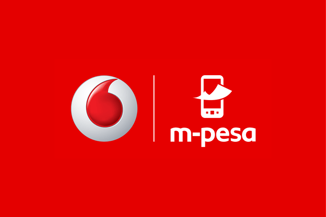

<p align="center"></p>

# Pesa SDK for Nodejs using M-Pesa Open API


[](https://travis-ci.org/openpesa/pesa-js)
[](https://npmjs.org/package/@openpesa/pesa-js)

The **Pesa SDK for Node.js** makes it easy for developers to access [OpenAPI](https://openapiportal.m-pesa.com/) in their Javascript code, and build robust applications and software using services like Customer 2 Bussiness, Query, etc.

## Documentation

Take a look at the [API docs here](https://pesa-js.netlify.app/).

## Getting Started

1. **Sign up for OpenAPI Portal** – Before you begin, you need to sign up for an account and retrieve your credentials.

1. **Minimum requirements** – To run the SDK, your system will need to meet the
   [minimum requirements](https://pesa-js.netlify.app/docs/requirements.html), including having **Node >= 10.1**.
1. **Install the SDK** – Using [NPM](#) is the recommended way to install the
   Pesa SDK for JS. The SDK is available via [NPM] under the
   [`openpesa/pesa-js`](#) package. If the Composer is installed globally on your system, you can run the following in the base directory of your project to add the SDK as a dependency:
    ```sh
    npm install openpesa/pesa-js
    ```
    Please see the
    [Installation section of the User Guide](https://pesa-js.netlify.app/docs/installation.html) for more
    detailed information about installing the SDK through Composer and other
    means.
1. **Using the SDK** – The best way to become familiar with how to use the SDK
   is to read the [User Guide](https://pesa-js.netlify.app/docs/guide.html).

## Usage

### Quick Examples

```js
import { Forodha } from '@openpesa/pesa-js';

// Popolate the credtials
const api_key = 'your_api_key';
const public_key = 'the_public_key';

// Intiate with credentials
let forodha = new Forodha({ api_key, public_key });

// Setup the transaction
let data = {
    input_Amount: 10000,
    // ..
};

// Execute the transaction
let result = forodha.transact('c2b', data);

result
    .then((data) => {
        // Print results
        console.log(data);
    })
    .catch((e) => {
        console.log('err: ' + e);
    });
```

### Testing

```bash
npm test
```

## Opening Issues

If you have a feature request or you encounter a bug, please file an issue on [our issue tracker on GitHub](https://github.com/openpesa/js-pesa/issues).

### Security

If you discover any security-related issues, please email [alphaolomi@gmail.com](mailto:alphaolomi@gmail.com) instead of using the issue tracker.

## Credits

-   [Alpha Olomi](https://github.com/openpesa)
-   [All Contributors](../../contributors)

## License

The MIT License (MIT). Please see [License File](LICENSE.md) for more information.
