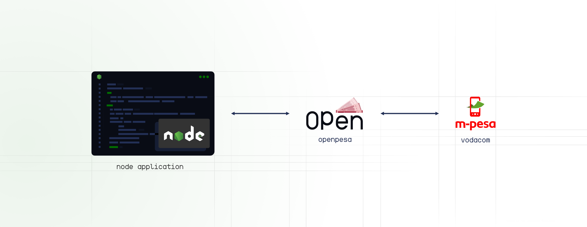

<h1 align="center">Node pesa</h1>

<p align="center">
    <a href="https://www.npmjs.com/package/@openpesa/pesa-js">
        
    </a>
    <a href="https://npmjs.org/package/@openpesa/pesa-js">
        
    </a>
</p>

<p align="center">
 <picture>
      <source media="(prefers-color-scheme: dark)" srcset="./img/banner/header-dark.png">
      
    </picture>
 <p align="center"><p>Integration that simplifies access to <a href="https://openapiportal.m-pesa.com/login">M-Pesa's OpenAPI</a> for developers to build applications/ software by providing easy access to services like Customer to Business (C2B), Query, and more.</p>
</p>
</p>

<p align="center">
    <a href="https://github.com/openpesa/node-pesa/issues/new/choose">Report Bug</a>
    ·
    <a href="https://github.com/openpesa/node-pesa/issues/new/choose">Request Feature</a>
</p>

## 🚧 Documentation

Take a look at the [API docs here](https://openpesa.github.io/pesa-js/).


## 🚀 Getting Started

1. **Sign up for OpenAPI Portal** – Before you begin, you need to sign up for an account and retrieve your credentials.

1. **Minimum requirements** – To run the SDK, your system will need to meet the
   [minimum requirements](https://openpesa.github.io/pesa-js/guide/installation#system-requirements), including having **Node >= 10.1**.
1. **Install the SDK** – Using [NPM](#) is the recommended way to install the
   Pesa SDK for JS. The SDK is available via [NPM] under the
   [`openpesa/pesa-js`](https://www.npmjs.com/package/@openpesa/pesa-js) package. You can run the following in the base directory of your project to add the SDK as a dependency:
    ```sh
    npm install openpesa/pesa-js
    ```
    Please see the
    [Installation section of the User Guide](https://openpesa.github.io/pesa-js/installation.html) for more
    detailed information about installing the SDK through Composer and other
    means.
1. **Using the SDK** – The best way to become familiar with how to use the SDK
   is to read the [User Guide](https://openpesa.github.io/pesa-js/).

## 💼 Usage

```js

import { Pesa } from '@openpesa/pesa-js';

// Populate the credentials
const api_key = 'your_api_key';
const public_key = 'the_public_key';

// Intiate with credentials
let pesa = new Pesa({ api_key, public_key });

// Setup the transaction
let data = {
    input_Amount: 10000,
    // ..
};

// Execute the transaction
pesa.c2b(data)
    .then((data) => {
        // Print results
        console.log(data);
    })
    .catch((e) => {
        console.log('err: ' + e);
    });

```

## 🧪 Test

```bash

npm test

```

## 🗺️ Road Map

1. Validate data input using Regex before the API call.
2. If fields are not provided then generate a random string for "input_ThirdPartyConversationID" and "input_TransactionReference"
3. Allow optional input for not required fields in a request.
4. Check and Throw an error when used outside of Node.js due to security reasons, Advice on use outside Node.js.
5. Validate Secret Keys length and format.
6. Allow user use custom sessionID on any/each transaction. (Portal allow for seesion with several hours of validity)
7. Add and improve documentation and examples(example will include expressjs app)

## 📜 Changelog

Please see [CHANGELOG](CHANGELOG.md) for more information on what has changed recently.

## 🤝 Contributing

Please see [CONTRIBUTING](.github/CONTRIBUTING.md) for details.

## 🔐 Security Vulnerabilities

Please review [our security policy](../../security/policy) on how to report security vulnerabilities.

## 👥 Credits

-   [All Contributors](../../contributors)

## 📄 License

The MIT License (MIT). Please see [License File](LICENSE.md) for more information.
